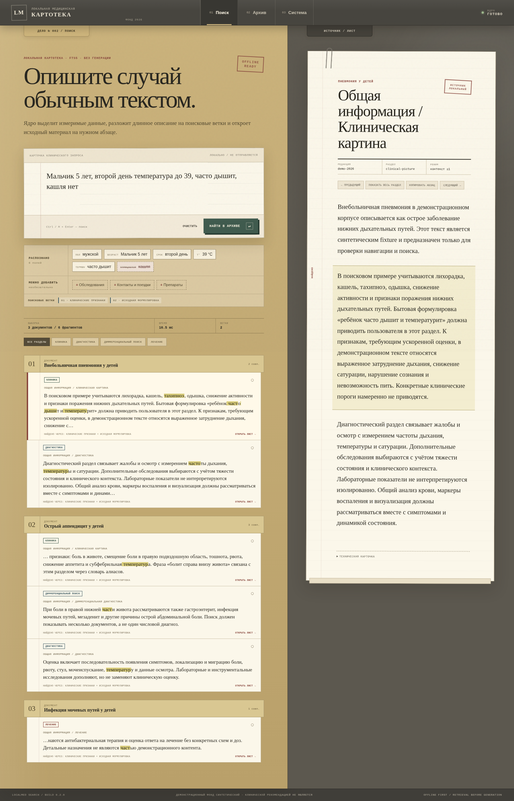

# MiniMed

MiniMed is an offline-first navigator over Russian clinical recommendations, medication sources and
regulatory documents. It accepts a free-form clinical query, extracts a transparent case structure,
searches local SQLite knowledge packs and opens the relevant source at an exact section or chunk.

> MiniMed is an engineering and clinical-reference pilot. Its datasets are incomplete and it must not
> be used as an autonomous diagnostic or treatment system. Deterministic source search remains the
> primary product. Local models are optional until their source-grounded path passes the documented
> Russian clinical safety gates.



## Current release — 0.3.3

The current APK release provides:

- a 15-document Russian public pilot with source-linked clinical, medication and regulatory records;
- deterministic Russian query parsing, lexical search, local vector search and hybrid rank fusion;
- exact document, section and chunk navigation with neighboring source context;
- a SolidJS application and Capacitor Android shell;
- local history and bookmarks;
- persistent installed-module registry metadata with rollback state;
- an optional six-model local-AI catalog with automatic device-fit selection and a startup viability
  test;
- CPU/WebAssembly GGUF loading in browsers and the current Android WebView path;
- deterministic Python ingestion for Markdown, TXT and PDF sources;
- Biome, strict TypeScript, Vitest, pytest, Ruff, Pyright, Playwright and GitHub Actions verification.

The local model in 0.3.3 is not connected to diagnosis, treatment, dose selection, retrieval ranking
or clinical-answer generation. MiniMed remains usable without a model or network connection.

## Roadmap

The roadmap is version-oriented rather than date-oriented. A milestone is complete only when its
acceptance criteria pass in CI and, where required, on physical Android devices.

| Version | State | Primary goal | Release gate |
| --- | --- | --- | --- |
| **0.3.3** | Released | Public pilot, module registry and local-model runtime foundation | Verified APK with the embedded 15-document corpus |
| **0.3.4** | In development | Loadable full-text datasets and doctor-facing UX | Real modules can be downloaded, verified, persisted, searched, removed and rolled back |
| **0.3.5** | Planned | Complete categorized Russian source inventory and bulk module production | Every discovered current record has an explicit coverage state; every verified usable source is published in a categorized module with benchmarks |
| **0.3.6** | Planned | Working source-grounded local assistant | At least one supported local model performs query planning, clarifications and reranking on Android with exact evidence links and deterministic fallback |
| **0.4.0** | Planned | Doctor pilot suitable for routine offline reference use | Broad clinical, medication and regulatory coverage; working grounded LLM; production delivery, recovery and physical-device qualification |

### Coverage policy

MiniMed does not use a fixed recommendation-count target. The objective is the maximum safely
verifiable coverage available from declared sources.

The corpus inventory must assign every discovered record one explicit state:

- `published` — extracted, validated and present in an immutable loadable module;
- `metadata-only` — discoverable in search, but the full source is not yet distributable;
- `needs-review` — extraction succeeded but structure, edition or medical provenance needs review;
- `blocked-source` — the source is unavailable or technically inaccessible to the build pipeline;
- `licence-restricted` — metadata may be indexed, but source redistribution is not permitted;
- `superseded` or `historical` — retained with an explicit relationship to the current edition;
- `failed-validation` — rejected by checksum, structure, integrity or retrieval gates.

Release reports must show discovered, published, metadata-only, blocked, restricted, superseded and
failed counts by source family and specialty. A smaller honest catalog is preferable to silently
claiming completeness.

### 0.3.4 — loadable datasets and clinician UX

This is the active milestone in [PR #98](https://github.com/T-Damer/MiniMed/pull/98).

Planned release contents:

- a shared modal-style document reader outside tab navigation;
- compact medical-text layout, document search and exact-anchor navigation;
- an interactive canvas knowledge graph with pan, zoom and dragging;
- plain-language Russian UI with technical diagnostics hidden in collapsible sections;
- explicit model selection and an exact-model download/load/structured-response test;
- readable model failure details and retry actions;
- GitHub-first model downloads for checksum-verified redistributable models;
- browser and Android-WebView persistence for downloaded SQLite modules;
- checksum, SQLite integrity, foreign-key and FTS validation before activation;
- live mounting of enabled modules through the multi-store search router;
- the first downloadable Russian regulatory module;
- the first full-text respiratory module containing pneumonia, bronchitis and bronchiolitis
  recommendations.

The 0.3.4 release is blocked until both datasets build from declared sources, pass integrity and
retrieval checks, install successfully in the application and survive an application restart.

### 0.3.5 — complete corpus inventory and module production

- inventory all discoverable current clinical recommendations rather than stopping at an arbitrary
  document count;
- group clinical sources into coherent specialty modules, including pediatrics, infectious diseases,
  respiratory/allergy, cardiology, gastroenterology, nephrology/urology, neurology, psychiatry,
  endocrinology, hematology/oncology, surgery, obstetrics/gynecology, emergency care and other
  specialties represented by the source catalog;
- build separate medication modules from official registration identity, instructions and structured
  facts, with unreviewed doses never promoted to trusted knowledge;
- build regulatory modules from the official legal-publication API and declared historical sources;
- generate a machine-readable coverage ledger with category, edition, source, rights, extraction and
  publication status for every record;
- add grounded retrieval scenarios for every major imported section and category-level regression
  thresholds;
- introduce resumable/background Android downloads and a native private-file storage adapter;
- offer original PDFs as separate optional source assets where redistribution permits;
- preserve old validated module versions for safe rollback;
- surface superseded, historical and conflicting versions explicitly.

### 0.3.6 — working source-grounded local assistant

The model may assist only after deterministic retrieval has produced candidate evidence. A working
local model is required for this milestone, but ordinary search must remain fully independent.

- structured query decomposition and terminology normalization;
- selection of useful clarifying questions;
- reranking only among already retrieved source fragments;
- concise output with exact document and chunk anchors;
- strict JSON schemas, bounded context and deterministic fallbacks;
- rejection of unsupported claims and ungrounded numerical doses;
- Russian tests for negation, age, pregnancy, allergy, renal impairment, route, units and
  per-dose/per-day distinctions;
- an exact-model test report that distinguishes download, checksum, initialization, memory,
  generation and schema failures;
- at least one qualified Android model delivered through the MiniMed GitHub mirror;
- native LiteRT-LM CPU/GPU/NPU adapter and physical-device benchmarks where hardware support exists.

### 0.4.0 — doctor pilot

- maximum verified coverage from the current clinical-recommendation inventory, categorized into
  loadable specialty modules;
- loadable medication and regulatory catalogs with explicit provenance, edition and rights status;
- a working source-grounded local assistant with deterministic fallback and exact evidence links;
- production-signed Android builds and stable/preview content channels;
- reliable module migrations, interrupted-update recovery and storage management;
- physical-phone and tablet usability review, including keyboard, safe-area and back-button behavior;
- privacy-safe diagnostics that can be copied when reporting an error;
- provenance and version visibility suitable for clinical source auditing;
- documented recovery when a model or dataset cannot be loaded;
- a broader clinician-reviewed Russian UX pass.

### Later milestones

- reviewed disease–symptom–test–medication knowledge-graph relations;
- personal notes that become searchable without entering the shared medical corpus;
- desktop and iOS packaging;
- optional source-aware comparison between historical and current recommendations;
- additional countries and international source families as separate applicability layers.

Detailed task-level work is tracked in [`docs/TODO.md`](docs/TODO.md). Dataset architecture is
explained in [`docs/FULL_DATASETS.md`](docs/FULL_DATASETS.md).

## Roadmap maintenance policy

Every version or release PR must update this README in the same change set:

1. update the **Current release** version and shipped capabilities;
2. mark the released roadmap row as **Released**;
3. move the next milestone to **In development** and state its measurable release gate;
4. update the coverage ledger and category totals instead of reporting only a hand-picked count;
5. remove, split or defer work that did not ship rather than presenting it as completed;
6. keep [`CHANGELOG.md`](CHANGELOG.md), [`docs/TODO.md`](docs/TODO.md) and release notes consistent;
7. preserve safety boundaries explicitly when model or medical-content capabilities change.

The roadmap describes outcomes and acceptance criteria. Implementation-level tasks belong in
`docs/TODO.md`, architecture documents, issues and pull requests.

## Runtime storage paths

```text
Browser
  → packaged core database
  → SQLite WASM / FTS5
  → downloaded module databases in IndexedDB

Android
  → packaged core database in private application storage
  → native SQLite when available
  → SQLite WASM fallback
  → current downloaded-module adapter through Android WebView storage
```

A native Android private-file and background-download adapter is planned for 0.3.5.

## Quick start

Requirements: Bun 1.2.3, Node.js 22.12+, Python 3.12+ and `uv`.

```bash
corepack enable
bun install --frozen-lockfile
bun run content:sync
bun run content:build
bun run dev
```

Run the verification suite:

```bash
bun run verify
CHROMIUM_PATH=/usr/bin/chromium bun run test:e2e
```

Prepare mobile projects:

```bash
bun run build:app
bun run native:sync
bun run native:source:check
```

Physical-device checks are documented in [`docs/NATIVE_SMOKE.md`](docs/NATIVE_SMOKE.md).

## Prepare a private corpus

Raw recommendations remain under the ignored `data/raw/` workspace:

```bash
cp docs/examples/private-sources.yaml data/raw/sources.yaml
# Put referenced PDF/TXT files in data/raw and edit the registry.

bun run content:prepare:private
bun run content:lint:private
bun run content:build:private
```

The preparer does not summarize medical content. It removes repeated marginalia, detects probable
structure, records extraction warnings and adds hidden source markers that compile into chunk/page
metadata. See [`docs/INGESTION.md`](docs/INGESTION.md).

## Repository map

```text
apps/app                    SolidJS + Capacitor application
apps/landing                Static Astro project page
packages/contracts          Runtime-validated public DTOs
packages/domain             Medical document domain model
packages/core               Query analysis, retrieval orchestration and rank fusion
packages/storage            Storage/search port and in-memory adapter
packages/storage-sqlite     SQLite WASM adapter, migrations and FTS5
packages/storage-capacitor  Capacitor/native SQLite adapter
packages/search-lexical     Russian normalization and deterministic case planning
packages/search-semantic    Embedding profiles, portable vectors and cosine helpers
packages/test-fixtures      Synthetic test-only content and fixtures
tools/ingest                Source preparation and deterministic content-pack builder
tools/benchmarks            Retrieval and clinical-query benchmark runners
schema                      Shared SQL contract
docs                        Product, ingestion, architecture, roadmap and handoff documents
```
